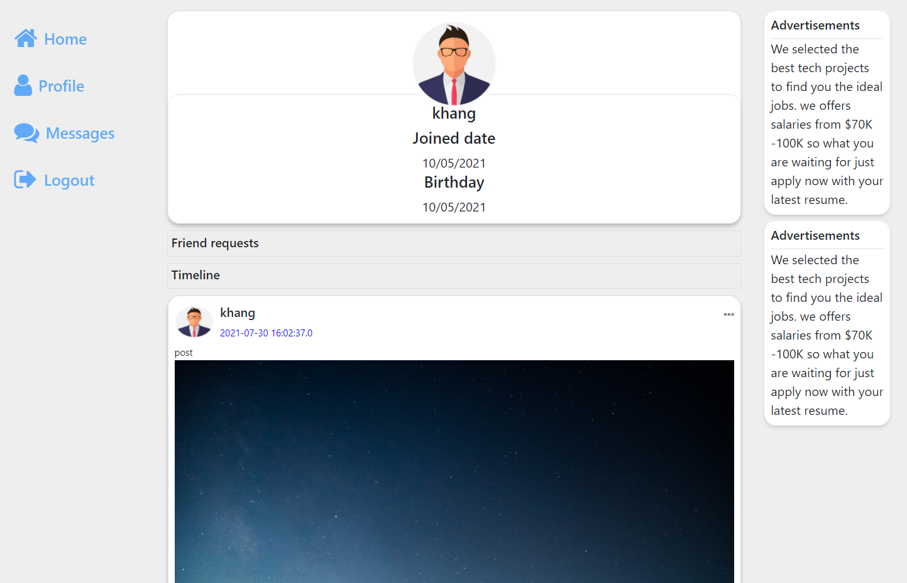
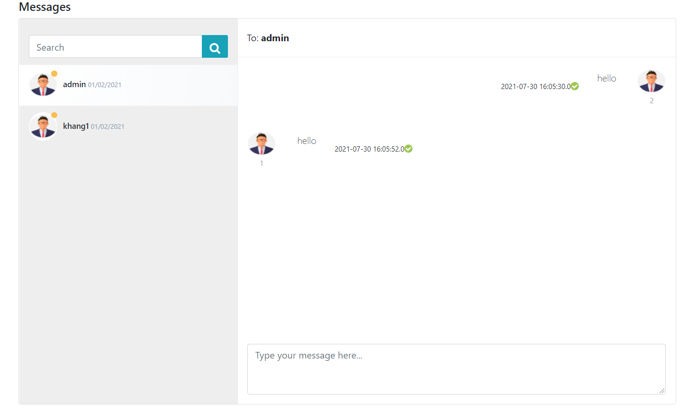

- A basic social media web app built with jsp/servlet.

## Features
- User login.
- News feed, like & comment posts.
- View user profiles & add friends.
- Search for users.
- Real time chatting with friends.

## Demo
- You can visit the website at link: https://socialnetworkservlet.herokuapp.com/Login.jsp

## Installation on localhost
- Install java 8.
- Install MySQL & import database.
- In Eclipse IDE, run file Login.jsp to open login page.

## Screenshots
- News Feed.

- User profile.

- Messages.

